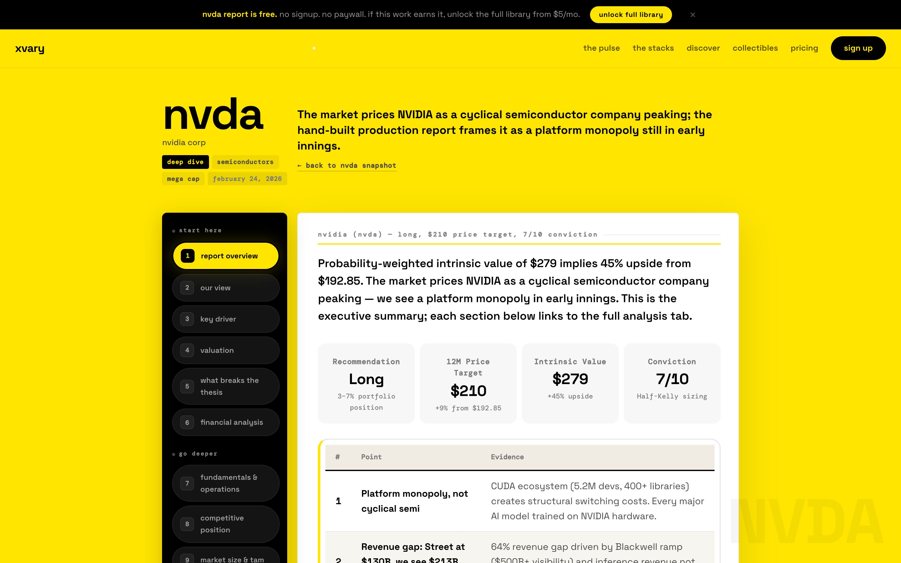

# XVARY Stock Research

[](./LICENSE)
[](https://www.python.org/)
[](./SKILL.md)
[](https://xvary.com)

Type `/analyze NVDA` in Claude Code and get a thesis-driven equity report with conviction scoring, kill criteria, and an EDGAR-backed financial snapshot from public data.

This is the open skill layer of [XVARY Research](https://xvary.com). The full 22-section deep dives live at [xvary.com](https://xvary.com).

## Screenshots (product context)

Captured from **[xvary.com/stock/nvda/deep-dive/](https://xvary.com/stock/nvda/deep-dive/)** — images are pre-bundled under `assets/`.

<p align="center">
  <a href="https://xvary.com/stock/nvda/deep-dive/" title="Open NVDA deep dive"></a>
</p>

## Quick start

From this folder:

```bash
cd xvary-stock-research
python3 tools/edgar.py AAPL
python3 tools/market.py AAPL
```

### Install as a Claude Code skill

```bash
mkdir -p ~/.claude/skills/xvary-stock-research
cp SKILL.md ~/.claude/skills/xvary-stock-research/
cp -R references tools examples ~/.claude/skills/xvary-stock-research/
```

**Standalone repo (full plugin bundle):** [github.com/xvary-research/claude-code-stock-analysis-skill](https://github.com/xvary-research/claude-code-stock-analysis-skill)

### Commands

| Command | What it does |
| --- | --- |
| `/analyze {ticker}` | Thesis + scorecard + risks + EDGAR-backed financial snapshot |
| `/score {ticker}` | Momentum, Stability, Financial Health, Upside Estimate |
| `/compare {A} vs {B}` | Side-by-side score and risk differential |

## Example

Full walkthrough: [examples/nvda-analysis.md](./examples/nvda-analysis.md)

## Tests

```bash
python3 -m pytest tests/
```

## References

- Methodology: [references/methodology.md](./references/methodology.md)
- Scoring: [references/scoring.md](./references/scoring.md)
- EDGAR usage: [references/edgar-guide.md](./references/edgar-guide.md)

## License

MIT. See [LICENSE](./LICENSE).

**Credit:** [XVARY Research](https://xvary.com) product and methodology.
